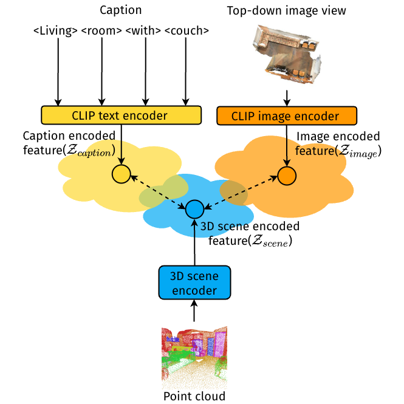

# CLIP-Guided Vision-Language Pre-training for Question Answering in 3D Scenes
<p align="middle">
  
</p>

This is the repository of the paper "[CLIP-Guided Vision-Language Pre-training for Question Answering in 3D Scenes](https://arxiv.org/abs/2304.06061)" (CVPR Workshops '23).


## Installation

### Code

1. Install CUDA-enabled PyTorch by following <https://pytorch.org/get-started/locally/> (Note that this code has been tested with PyTorch 1.9.0 and 1.10.2 + cudatoolkit 11.3).

2. Install the remaining necessary dependencies with `requirements.txt`: 

    ```shell
    pip install -r requirements.txt
    ```

3. Compile the CUDA modules for the PointNet++ backbone by running `setup.py` inside `lib/pointnet2/`:

    ```shell
    cd lib/pointnet2
    python setup.py install
    ```

    (Note that this requires the full CUDA toolkit. If it fails: goto [Troubleshooting](#troubleshooting).


### Data

1. Download the [ScanQA dataset](https://drive.google.com/drive/folders/1-21A3TBE0QuofEwDg5oDz2z0HEdbVgL2?usp=sharing) under `data/qa/`.

2. Download the ScanRefer dataset and unzip it under `data/`. To download the ScanRefer dataset you need to fill out [this form](https://forms.gle/aLtzXN12DsYDMSXX6).

3. Download the ScanNetV2 dataset and put `scans/` under `data/scannet/`. To download the ScanNetV2 dataset, follow <https://github.com/daveredrum/ScanRefer/blob/master/data/scannet/README.md>.

4. Generate the top-down image views for all scenes with `run_generate`(`generate_top_down.py` renders the top-down image view for a single scene):

   ```shell
    python run_generate.py
    ```

5. Download the PointNet++(-1x) checkpoint from <https://github.com/facebookresearch/DepthContrast> and store [checkpoint](https://dl.fbaipublicfiles.com/DepthContrast/pointnet1x/checkpoint-ep150.pth.tar) under directory: `checkpoints/`
    

In the end, the `data/` directory should have the following structure:

```shell
data/
├── qa/
├── scannet/
│   ├── batch_load_scannet_data.py
│   ├── load_scannet_data.py
│   ├── meta_data/
│   ├── model_util_scannet.py
│   ├── scannet_data
│   ├── scannet_utils.py
│   ├── scans/
│   └── visualize.py
├── ScanRefer_filtered.*
└── top_imgs/
```

## Usage

### Pretraining 

- Execute `scripts/pretrain.py`:

    ```shell
    python scripts/pretrain.py --no_height
    ```

### Training

- Execute `scripts/train.py`:

    - Training with pre-trained weights:
    
        ```shell
        python scripts/train.py --no_height --tokenizer_name clip --pretrain_src <folder_name_of_ckpt_file>
        ```
        **<folder_name_of_ckpt_file>** corresponds to the folder under outputs/ with the timestamp +  (optional) <tag_name>.
    - Training from scratch:

        ```shell
        python scripts/train.py --no_height --tokenizer_name clip
        ```

### Inference

- Evaluation of trained models with the val dataset:

    ```shell
    python scripts/eval.py --folder <folder_name> --qa --force --tokenizer_name clip
    ```

  **<folder_name>** corresponds to the folder under outputs/ with the timestamp + <tag_name>.

## Troubleshooting
- Installation of `open3d` fails:
    
    ```command
    user@device:~/3D-VQA-dev$ pip install open3d
    ERROR: Could not find a version that satisfies the requirement open3d (from versions: none)
    ERROR: No matching distribution found for open3d
    ```
    - Make sure to generate the topview images on a desktop computer. The device that you are running the training on, might not have a prebuilt `open3d` package available 
    - Comment `open3d` in `requirements.txt` and thus omit the installation of `open3d` on this device
- Execution of `lib/pointnet2/setup.py` fails:
    ```command
    user@device:~/3D-VQA-dev/lib/pointnet2$ python setup.py install
    OSError: CUDA_HOME environment variable is not set. Please set it to your CUDA install root.
    ```
    - Make sure that `CUDA_HOME` is set.
    
    ```command
    user@device:~/3D-VQA-dev$ python lib/pointnet2/setup.py install
    FileNotFoundError: [Errno 2] No such file or directory: '_version.py'
    ```
    - Make sure to execute the code inside of `lib/pointnet/` as described in [cudalayers installation](#cuda_layers)

## BibTeX
```
@inproceedings{Parelli_2023_CVPR, 
	author = {Maria Parelli and Alexandros Delitzas and Nikolas Hars and Georgios Vlassis and Sotirios Anagnostidis and Gregor Bachmann and Thomas Hofmann}, 
	title = {CLIP-Guided Vision-Language Pre-Training for Question Answering in 3D Scenes}, 
	booktitle = {Proc. of the IEEE/CVF Conference on Computer Vision and Pattern Recognition Workshops (CVPRW)}, 
	year = {2023}
}
```

## Acknowledgements
This project builds upon [ATR-DBI/ScanQA](https://github.com/ATR-DBI/ScanQA) and [daveredrum/ScanRefer](https://github.com/daveredrum/ScanRefer). It also makes use of [openai/CLIP](https://github.com/openai/CLIP).


